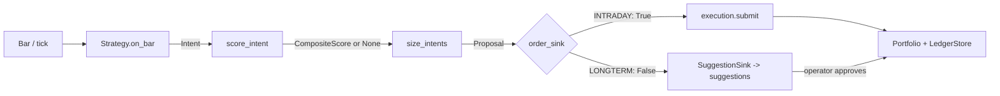
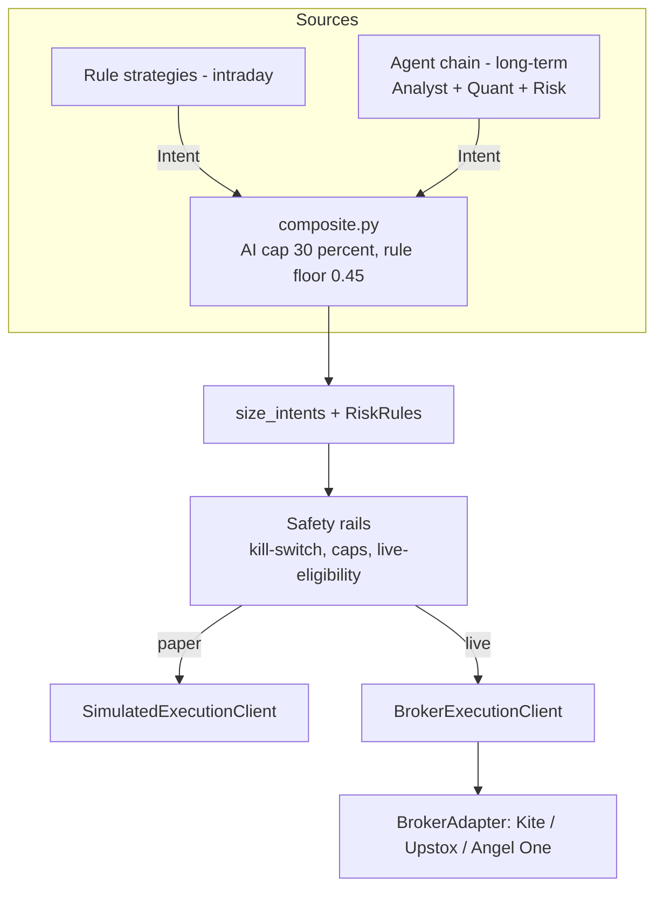

# NeoTrade — architecture

Three sections: **as-built** (what the code does today, with anchors), **target** (where it
is going), and **the delta** (which roadmap phase closes each gap). When as-built and the
code disagree, the code is right and this document is a bug — fix it in the same commit.

Companion documents: [`../PRODUCT.md`](../PRODUCT.md) for what the product is and who it
serves, [`ROADMAP.md`](ROADMAP.md) for the phase order and done-when criteria,
[`../DESIGN.md`](../DESIGN.md) for the visual system.

---

## 1. As-built

### 1.1 The decision pipeline

There is exactly one live path from market data to a trade. It does not involve the LLM
agent graph.

| Stage | Where | What it produces |
|---|---|---|
| Strategy | `backend/engine/protocols.py:37-42` (`Strategy` Protocol), `backend/strategies/base.py:30-56` | `Intent` |
| Scoring | `backend/scoring/composite.py:45-56` (`score_intent`; news sentiment turned to face the trade by `is_bearish`, `:37-42`) | `CompositeScore` or `None` |
| Sizing | `backend/engine/runner.py:58-220` (`size_intents`) | `Proposal` |
| Routing | `backend/engine/runner.py:293-429` (`run`), `backend/suggestions/sink.py:32-50` | order **or** suggestion |
| Fills | `backend/engine/execution/simulated.py:18-77` | `Fill` |
| Book | `backend/engine/portfolio.py:14-57`, `backend/engine/persistence.py` | positions, PnL, ledger |

`Intent` (`backend/core/models.py:50-79`) is deliberately thin: `symbol`, `side`,
`strength` (0–1), `reason_codes` (non-empty, enforced in the constructor), `stop_hint`,
`target_hint`. No entry price, no sizing, no timestamp — those are added downstream. This
thinness is what makes the scoring cap below possible, so treat it as load-bearing.

### 1.2 The invariants — do not break these silently

These implement `PRODUCT.md`'s claim of *legible machine conviction*. They are enforced in
code and covered by tests, not left to discipline.

- **AI is capped at 30% of conviction.** `AI_CAP = 0.30`
  (`backend/scoring/composite.py:15`). `CompositeScore.__post_init__`
  (`composite.py:25-30`) clamps `ai_weight` via `object.__setattr__` on a frozen dataclass,
  so a caller passing `0.99` still gets `0.30`. Tested in
  `backend/tests/test_composite_score.py:18-20`.
- **AI cannot rescue a trade the rules did not support.** `RULE_FLOOR = 0.45`
  (`composite.py:16`); `score_intent()` returns `None` outright when
  `intent.strength < RULE_FLOOR`, and `runner.py:113-115` skips the intent entirely. Tested
  arithmetically in `test_composite_score.py:11-15`.
- **Every intent must carry reasons.** `Intent.__post_init__` rejects empty `reason_codes`
  (`core/models.py:75-79`). A trade with no explanation cannot exist.
- **Every per-account record carries `user_id`.** See §1.4.

### 1.3 Risk and sizing

One shared module: `RiskRules` (`backend/components/risk/risk.py:85-121`) —
`calculate_position_size(account_size, risk_per_trade_percent, entry_price, stop_loss)` and
`check_exposure_limit(...)`.

It has exactly one production caller: `size_intents` (`backend/engine/runner.py:183,196`),
where risk per trade scales with conviction: `risk_pct = BASE_RISK_PCT * scored.final`
(`runner.py:182`). Position sizing lives downstream of the strategy, never inside it.

### 1.4 Auth and multi-tenancy

Multi-user is largely already built, contrary to what older docs implied.

| Piece | Where |
|---|---|
| Google ID-token verification (no redirect flow, no client secret) | `backend/auth/google.py:26-43` |
| `User` model — `id, google_sub, email, name, picture, created_at` | `backend/auth/models.py:7-13` |
| `users` collection, unique index on `google_sub` | `backend/auth/store.py:36,38-59` |
| Session JWT, 30-minute lifetime | `backend/auth/jwt.py:12-23`, `backend/configs/settings.py:50` |
| Refresh tokens — opaque, SHA-256 hashed, rotated, replay-detecting, httpOnly cookie scoped to `/api/v1/auth` | `backend/auth/refresh_store.py:73-98`, `backend/routers/auth.py:23-38` |
| `get_current_user` as a router-level dependency | `backend/auth/dependency.py:16-28`, applied in `backend/server.py:103-136` |
| WebSocket auth (token as query param — browsers can't set WS headers) | `backend/ws/routes.py:41-48` |

User-scoped collections: `paper_orders`, `paper_fills`, `paper_positions`, `paper_trades`
(`backend/engine/persistence.py:30-36`, `user_id` stamped on write and filtered on every
read), `suggestions` (`backend/suggestions/store.py`), `user_prefs` (`backend/prefs.py`),
`trading_runs` (`backend/runs.py`), `watchlist` (`backend/routers/watchlist.py`).

The engine ledger holds two books. Every `Fill` carries `venue` (`"paper"` by default,
`"live"` only when `BrokerExecutionClient` reports a real broker fill); `Portfolio.apply`
stamps it on the position that fill opens, and `LedgerStore._open_trade` on the round trip,
which keeps it through its close. `LedgerStore.get_trades/get_fills/get_open_positions` and
the `/trading/{trades,fills,positions,equity}` and `/analytics/pnl` routes take `?venue=`;
`venue_filter` (`backend/engine/persistence.py`) reads "paper" as "not live", so rows written
before the tag existed stay in the paper book and can never leak into the live one. The
frontend's Paper tab asks for `venue=paper`, the statement for `venue=live`.

Correctly global (shared reference data, not personal): `instruments`, `instrument_meta`,
and the `analyst:{symbol}` / `sentiment:{symbol}` Redis caches (4 hours, written by
`AnalystAgent`, `backend/components/analyst/agent.py`).

### 1.5 Suggestions (the long-term approval inbox)

- Created by `SuggestionStore.create` (`backend/suggestions/store.py:31-70`), persisting the
  sized order plus the score breakdown `{rule, ai, final}` and publishing to the WS hub.
- Rescored by `attach_theses` (`backend/suggestions/thesis.py`) once research has measured
  real news sentiment, through the same `CompositeScore`. At scan time the sentiment cache
  is usually empty, so the AI half starts neutral.
- Approved/rejected by `store.decide()` (`store.py:96-122`) using an atomic
  `find_one_and_update` gated on `status == PENDING` — double-approval is impossible by
  construction.
- Executed on approval by `backend/suggestions/service.py:19-45`, against a *fresh* mark
  price rather than the stale bar the engine last saw.
- Expire after 3 days (`DEFAULT_TTL`, `store.py:20`; `expire_stale`, `store.py:130-136`).
- Generated either by a live run (`POST /trading/start`) or by `scan_universe`
  (`backend/suggestions/scan.py:76-138`), which replays ~400 days of history through the
  same runner and only arms the sink on the final session (`_ArmOnFinalSession`,
  `scan.py:33-51`) so warmup intents never become suggestions.

### 1.6 Execution and backtest

`SimulatedExecutionClient` (`backend/engine/execution/simulated.py:18-77`) is the *only*
`ExecutionClient` implementation. It fills MARKET orders at the last-seen bar close and
applies Indian transaction costs (`backend/engine/execution/costs.py`). The same class
serves both backtest and paper trading.

`run_backtest` (`backend/engine/backtest.py:19-97`) wires `HistoricalFeed` + `SimClock` +
the simulated client through the *same* `runner.run()`, with no `order_sink`, so every
proposal executes. It returns `BacktestResult`
(`backend/components/shared/models.py:59-71`). Note: `max_drawdown` and `sharpe_ratio` are
hardcoded `0.0` (`backtest.py:94-95`) — they are not computed.

### 1.7 Brokers, data, and live updates

- **Broker adapters** live behind `BrokerAdapter` (`backend/brokers/protocol.py`): credential
  and token lifecycle, market data, instrument listing, and the seam order placement
  (Phase 5) slots into. Three adapters implement it, chosen per user by
  `backend.brokers.registry.get_broker_adapter`: `KiteAdapter` (composes the pieces below,
  no new behavior), `UpstoxAdapter`, and `AngelOneAdapter` (both real REST integrations, no
  SDK dependency). `/broker/{broker}/*` (`backend/routers/broker.py`) exposes status,
  login-url, connect, and disconnect for whichever broker the path names.
- Underneath `KiteAdapter`: `MarketDataProvider` (`backend/data/protocols.py:7-9`), implemented
  by `YFinanceProvider` and `KiteProvider`; `KiteSessionManager`
  (`backend/auth/kite_session.py`, the one module outside `backend/brokers/` still importing
  the `kiteconnect` SDK directly — reachable only from `backend/brokers/kite.py`); and
  `KiteTickerFeed` (`backend/data/feeds/live_kite.py`), which now **is** wired into the live
  intraday path via `BrokerAdapter.ticker_feed()`.
- `UpstoxAdapter.ticker_feed()` returns `UpstoxMarketFeed` (`backend/data/feeds/live_upstox.py`):
  Upstox's v3 market-data WebSocket, protobuf frames decoded by hand for the few fields
  used. `ticker_feed()` takes `Instrument`s, not tokens, because Upstox subscribes by
  `instrument_key`. Both feeds share `TickBarAggregator` (`backend/data/feeds/tick_bars.py`).
  `AngelOneAdapter` doesn't stream yet — `ticker_feed()` returns `None` and the caller falls
  back to polling, same as no broker connected. Polling for INTRADAY means
  `CandlePollingFeed` (`backend/data/feeds/candle_poll.py`): yfinance's own 5-minute candles,
  ~15 min delayed, each yielded once after it closes, polled just after every 5-minute
  boundary. The run's `params.feed` records which source a run used.
- Feeds behind `DataFeed` (`backend/engine/protocols.py:45-46`): `HistoricalFeed`,
  `PollingLiveFeed`, `CandlePollingFeed`, `KiteTickerFeed`, `UpstoxMarketFeed`.
- One WebSocket, `GET /api/v1/ws` (`backend/ws/routes.py:60-86`), topic pub/sub through an
  in-process `Hub` (`backend/ws/hub.py:24-95`). A 15-second pump
  (`backend/ws/pump.py:23,26-65`) publishes marks and recomputed PnL: per venue under `paper`/`live`, plus the combined figures at the top level for pre-venue clients; suggestion and run
  events are published reactively by their own stores.

### 1.8 Dead code (scheduled for revival, not deletion)

`QuantAgent` (`backend/components/quant/agent.py`), `RiskAgent`
(`backend/components/risk/agent.py`) and the legacy `backend/components/quant/strategies.py`
have **no production callers**. The LangGraph decision node was deliberately removed; what
survives is `ResearchAgent` (`backend/research/graph.py:58-159`), whose graph is
`resolve_query → company_info → analyst → synthesize → END` and which returns a narrative
`ResearchReport` with no BUY/SELL/HOLD, plus `AnalystAgent`. The chat lives in `backend/chat/` (2026-10-04): a
per-message day snapshot (`context.py`) in `prompts/chat.md`, read tools bound to the caller's `user_id`
(`tools.py`), and propose-only action tools whose records in `chat_actions` run only through
`POST /chat/actions/{id}/confirm`, which re-checks everything (`actions.py`). Besides the fixed
`get_*` tools, `query_my_data` reads any collection on its allowlist (`USER_DATA`, always ANDed
with the caller's `user_id`; `SHARED_DATA` for market reference data); secrets
(`broker_credentials`, `alert_channels`, `refresh_tokens`, `users`, `app_settings`) are off the
list, and `$where`/`$function` are refused. Each message also carries the trader's profile
(`format_profile`: Google name or `display_name`, trading profile, preferences, AI instructions,
memories) from `user_profiles` (`backend/profile/`, edited at `/profile`); the prompt treats it as
context that never overrides the confirm rules, and `propose_memory` cards add memories only on
Confirm. Each connected broker can have a role (`prefs.broker_roles`, `backend/brokers/roles.py`):
`ai` (one at most) or `mine`. Orders route by role and never fall back: engine live orders and the
autopilot use only `ai`; chat cards (orders, and `backend/chat/account_actions.py` exit / cancel /
modify / stop-loss) only `mine`. `backend/autopilot/` runs AI chat orders and, when enabled, the
09:20 engine proposals on the `ai` account without a tap -- only after `fence.check` (capital,
per-trade cap, trades/day, own daily-loss trip, shared kill switch, Nifty 200, NSE equity, market
hours; exits never blocked) -- paper unless `autopilot_live`, logged to `autopilot_log` and sent to
Telegram with a stop button. Portfolio, journal and chat tools take `account=all|ai|mine`;
`/journal/ai-vs-me` compares the two monthly. The same agent answers the user's linked Telegram
chat (`backend/guardrails/telegram_bot.py`): one worker per bot long-polls `getUpdates` under a
Redis lock, streams the reply with `sendMessageDraft` (reasoning and tool steps live, kept
collapsed in the final message), sends cards with Confirm/Cancel buttons that go through the
same confirm path, offers follow-ups as buttons, and keeps the last 10 turns in Redis. Since
2026-09-26 the analyst makes two LLM calls per stock (`prompts/score_news.md`, then
`prompts/research_report.md`, which also writes the thesis), so `synthesize` makes none.

Option chains (`backend/routers/options.py`) are read-only market data from the user's own
Upstox session -- Upstox's `/v2/option/chain` and `/v2/option/contract`, wrapped by
`UpstoxAdapter.option_chain`/`option_expiries` -- for NIFTY 50 and BANK NIFTY only. No
ACTIVE Upstox session is a 409 telling the user to connect it; an Upstox failure is a 502.

Option proposals (the cash-secured put) use real listed contracts from the broker's NFO dump
(`InstrumentMaster.option_contracts`) and a live premium from
`backend/options/premiums.py::live_premium_source` -- Kite's quote of the contract, else the
Upstox chain; Black-Scholes only as a fallback, flagged `premium_is_live: false`. The daily
scan passes that source into `run`/`size_intents`; approval fills at it
(`routers/suggestions.py::_live_option_premium`), and without a connected broker the
approval is a 409 rather than a guessed price.

A tapped index gets its own single LLM call: `explain_index_move`
(`backend/research/index_move.py`, served at `GET /market/index/{ticker}/analysis`) gathers
the latest session's OHLC and trend from yfinance, the other tracked indices, the day's
NIFTY 50 movers (Indian indices only) and up to 12 de-duplicated headlines from the last 48h,
then renders `prompts/index_move.md`, which explains the past session only (no forecasts or
calls). Results are cached in-process per ticker for 15 minutes; a failed call is a 503 and is
never cached. It never touches `Intent` or `composite.py` -- it is commentary, not a trade idea.

`RiskAgent` carries its own inert `confidence*0.6 + alignment*0.4` blend with a `0.25`
threshold (`components/risk/agent.py:95-99`) — a *different* formula from the enforced
30% cap. If the agents are revived (Phase 6), this formula must not come back with them;
the revived chain emits `Intent` and is scored by `composite.py` like everything else.

### 1.8a Ingest worker (data layer, Phase 14 in progress)

`backend/datalayer/worker.py` runs in its own `ingest` container (same image, `command:
python -m backend.datalayer.worker`, no port). One instance works at a time: it holds the Redis
lock `ingest:leader` (`backend/locks.py`, token-checked, 30s TTL renewed every 10s) and exits
when it loses it, so Docker restarts it as a waiter. Each loop (`_loops()`) writes
`ingest:heartbeat:{name}` after every pass that did not raise; `GET /health` reports their ages.
Loops so far (`backend/datalayer/prices.py`): `quotes` writes `quote:{SYMBOL}` (`{ltp, prev_close,
at}`) -- held and watched names every ~15s in session, the Nifty 200 every 5 min (10 min off
session), one batched yfinance download each; `macro` writes `macro:{yf ticker}` every 60s for
Indian and global indices, index futures, crude, gold, USD/INR, DXY and the US 10Y, plus one
Mongo `macro_series` doc per ticker per IST day. `marks.mark_prices` reads `quote:` first (≤60s
old by default; the autopilot's order price ≤20s, `ORDER_MAX_AGE_SECONDS`) and writes what it
fetches back; `/market/indices` and `/market/global` read `macro:`. The confirm paths that price
real orders (`routers/suggestions._live_mark_price`, `chat/actions._mark_price`) still always
fetch live.

**News** (`backend/datalayer/news_sources.py`, `news.py`). `news_poll` (60s) pulls ~20 RSS feeds
(ET, Moneycontrol, Mint, RBI, SEBI, PIB, CNBC, BBC, Google News business/world), Google News
searches (newest 8 results each: Indian market, macro, each NSE industry every 15 min, 5 company searches per pass --
held/watched every 15 min, the Nifty 200 round-robin), GDELT (global events, every 5 min) and NSE
corporate filings, and upserts each story once into Mongo `news_items` (`_id` = hash of the
normalised title; later sources only add `feeds`/`symbols`). Company symbols are tagged by name,
unique first word and ticker (`build_aliases`). `news_process` (every 5 min, batched to keep LLM calls
few: at most one call per stage per pass): `triage_news.md` (fast tier, up to 150 headlines, the
model lists only the ones to keep) keeps anything that could move Indian stocks -- global and macro included -- and
drops the rest (kept 7 days; relevant items 2 years, as learning data); `score_market_news.md`
(deep tier, up to 40 items in one call, at most `NEWS_LLM_CALLS_PER_DAY` = 200 per IST day) gives each item `impacts[]` on the market
(`INDIA`), NSE industries (`news_sources.sectors()`) or followed symbols, validated and clamped
(`valid_impacts`); impact >= 6 sets `material`. NSE filings skip triage. Items unscored after 3
days go STALE. `aggregate` then writes, from the last 60 days of impacts (impact² × 30-day
half-life, `ai/sentiment.weighted_sentiment`): `sentiment:{SYM}` = 0.6 company + 0.25 sector +
0.15 market for every followed symbol (still the single `ai_score` composite.py caps at 30%),
`sector_sentiment:{industry}`, `market:sentiment`, and `analyst_verdict:{SYM}` for symbols with
company news in 14 days. `AnalystAgent.analyze` answers followed symbols from the store
(`datalayer/analysis.py`, one `research_report` call when newer news or a moved sentiment makes
the cached note stale, a Redis lock so concurrent misses don't both pay) while the
`news_process` heartbeat is under 15 min; otherwise, and for unfollowed symbols, it fetches Google
News India on demand as before. The legacy `/news/fetch`, `/news/sentiment` and `/events/classify`
routes are gone.

**Backdrop** (`backend/datalayer/market.py`). `calendar` (6h) stores ForexFactory's weekly
high/medium-impact events for USD/CNY/EUR/JPY/GBP/All in Mongo `econ_calendar` (no Indian
releases: RBI MPC dates are not in that feed). `flows` (30 min) stores NSE's FII/DII net cash flows
in `market:flows` and `macro_series`. `regime` (60s, no LLM, `compute_regime`) writes
`market:regime` {score, label risk_on/neutral/risk_off, drivers}: half market news sentiment, plus
fixed rules on India VIX level and jump, Brent, USD/INR, S&P futures, FII flows, and a flag for a
high-impact event within 30 min. `brief` makes the one LLM call (`prompts/market_brief.md`,
standard tier): every 30 min in session, 3h outside, or sooner (never within 15 min) after a
material market/macro/global item; `market:brief` + Mongo `market_briefs`. Every
`research_report` gets the regime and brief as `{{backdrop}}`; the chat's day snapshot carries
regime, brief and the next 24h of high-impact events, and its tools `search_news` (stored scored
news by query/symbol/sector/scope; on-demand Google only for an unfollowed symbol) and
`get_market_backdrop` replace the uncached `fetch_news_tool`. `research/index_move.py` takes its
headlines from the store (falls back to Google when empty) and peer indices from `macro:`.

**Reactions** (`backend/datalayer/reactor.py`, `news_react` loop, 60s). Each SCORED `material` item
scored in the last 30 min (published in the last 6h) is claimed once with `reacted_at` and alerted
to users by their `news_alerts` pref (`held` default, `held+watched`, `all`, `off`): impacts >= 6 on
a followed symbol or its sector, and a market impact >= 7 to anyone holding something. One alert per
user+target an hour (`news:alerted:{user}:{target}` NX). An alert is a Telegram message
(`suggestions/notify`) plus a `news`/`alert` socket event the app shows as a toast. The plan's
`news:events` stream was not needed: the reactor reads Mongo in the same process. `GET /news/feed`
(scope, mine, material, before) backs the Research › News page; `/today` carries `backdrop`
(brief, regime, next 24h high-impact events) for Today's Markets card. A second loop,
`news_scan` (120s, claimed with `scanned_at`), re-runs `suggestions/scan.scan_universe` with
`source="news"` for each scan-enabled user over the universe names an item materially moves
(direct hits first, then its sectors' names; market-wide items scan nothing), at most once per
user+symbol a day (`news:scanned:{user}:{symbol}` NX) and 20 symbols per user a pass; new PENDING
proposals get a thesis and a Telegram message like the 16:00 scan's. `scan_universe` now loads
`analyst_verdict:` for every scanned symbol, not just the F&O underlyings. With the autopilot and
`autopilot_news` (default off) on, those proposals go straight to `engine/autorun._autopilot_proposals`
with `source="news"`. `autopilot/fence.check` reads `market:regime` (via `service.regime_now`): risk-off
halves the per-trade cap (`fence.trade_cap`, also used to size) and refuses news entries, a
high-impact event within 30 min refuses every entry, and news entries stop at 3 a day; exits are
never blocked, and no regime adds no rule. `news_exits` (60s) only logs, in `autopilot_shadow`, the
SELL the autopilot would place on a material negative item (impact >= 8, direction <= -0.5, symbol or
sector) against one of its longs. Spec: `docs/superpowers/specs/2026-10-05-autopilot-news-design.md`.

**Outcomes** (`backend/datalayer/outcomes.py`, `news_outcomes` loop, 5 min). Each newly scored
material item gets a snapshot per impact target (a symbol's `quote:`, a sector's members' quotes, Nifty
`macro:^NSEI` for the market) in Mongo `news_outcomes`; at +1h (in-session snapshots only), +1d and
+5d it records the return and `move_{h}` (return over Nifty's; the market's own return for a market
target). No fetches: only the caches ingest already fills. Weekly it writes `news_theme_weights` and
Redis `news:theme_weights`: per `scope|theme|direction sign`, 1 + 2·(1d hit rate − 0.5) clamped to
0.5–1.5, from ≥ 20 outcomes in 180 days. `news.aggregate` scales each impact by its item's mean theme
weight before the weighted mean, so it shifts influence between items, never the −1..1 range. The
weekly job lives in the ingest worker rather than `scheduler._learn`, which is per user.

**Daily bars and fundamentals** (`backend/datalayer/bars.py`). `bars` (15 min, works once a day
after 15:45 IST, or at once on an empty store) writes Mongo `daily_bars` (unique `symbol+date`,
adjusted OHLCV) for the Nifty 200, the default scan list, every saved scan universe, held and watched
names: two years for a new symbol, the last month for a known one, everything again weekly (adjusted
prices shift after splits and dividends), ten years of `^NSEI`. `fundamentals` (daily) writes one
FundamentalSnapshot per symbol. Readers: `StoreHistoryProvider` / `StoreFundamentals`
(`backend/data/providers/store.py`, used by `scan_universe` and `research/quick.py`), `GET /scanner`,
portfolio closes and both NIFTY benchmark series. Each falls back to yfinance for an intraday
interval, a non-NSE or uncovered symbol, a newest bar over 4 days old, or a period longer than the
store holds. The store holds completed bars only, so in session the last bar is yesterday's.
Plan: `docs/superpowers/plans/2026-10-05-market-news-datalayer.md`. Compose makes `backend` depend on
`ingest` only so the shared deploy workflow's `up -d --build backend` also redeploys it.

### 1.9 Known structural limits

| Limit | Where | Consequence |
|---|---|---|
| No backtest gate | nothing marks a strategy live-eligible; `backend/strategies/registry.py:16-59` is the only filter | A registered strategy trades immediately |
| Single-process state | `_RUNS` (`routers/trading.py:66`), `ws/hub.py:9-10`, `scheduler.py:8-10` | Breaks with more than one worker |
| `llm_service` module singleton | `backend/llm.py:125` | Per-user model choice (`omniroute_model` in `user_prefs`) is stored but never read |
| `/trading/start` trusts request-body risk caps | `routers/trading.py:219-343` (`launch_run`) vs `scheduler.py:52-59` which reads `PrefsStore` | The manual path can bypass a user's stored limits |

---

## 2. Target

### 2.1 Two engines, one contract

Intraday trades must fire on mechanical rules with no LLM in the loop; long-term ideas
genuinely need news and sentiment reasoning that rules do badly. So NeoTrade keeps two
idea sources, joined by a single contract rather than merged into one pipeline.

Both sources emit `Intent` and pass through the same scoring cap and the same `RiskRules`
sizing. Neither may size its own positions, and neither may invent its own conviction
formula — that is what made the old `RiskAgent` blend a liability.

### 2.2 Broker adapter layer — built (Phase 2)

`backend/brokers/protocol.py`'s `BrokerAdapter` now exists, implemented by `KiteAdapter`,
`UpstoxAdapter`, and `AngelOneAdapter` (`backend/brokers/`), chosen per user by
`backend.brokers.registry.get_broker_adapter`. Every adapter instance is per user,
constructed from that user's own stored, encrypted credentials — never from process-global
settings — and token caches are keyed by user id (`broker:{user_id}:{broker}:access_token`).
Order placement is the one protocol method with no real implementation yet — that's Phase 5.

### 2.3 Execution

A second `ExecutionClient` implementation over `BrokerAdapter`, alongside the simulated one.
Live execution needs what simulation does not: an order state machine (submitted →
acknowledged → partially filled → filled/rejected/cancelled), reconciliation against the
broker's own fill and position reports as the source of truth, and idempotent submission so
a retry cannot double-place. Paper versus live is a per-user, per-strategy setting.

### 2.4 Safety rails

Enforced in code, inside the sizing path, so no caller can route around them:

- **Daily loss kill-switch** — live trading halts for the rest of the session once
  realized + unrealized loss crosses the user's limit, and does not re-arm by itself.
- **Backtest gate** — a strategy is live-eligible only if a stored, dated backtest result
  meets the criteria in [`ROADMAP.md`](ROADMAP.md) Phase 3. Requires
  `max_drawdown`/`sharpe_ratio` to actually be computed, unlike today. The gate governs
  **live routing only**: `launch_run` (`backend/routers/trading.py`) runs every registered
  strategy for the mode on paper and hands a strategy a `BrokerExecutionClient` only when it
  is toggled live, the broker session is ACTIVE, *and* it passes the gate. Until 2026-09-26
  the gate also dropped unproven strategies from paper runs, which left no way to build the
  paper track record the product relies on.
- **Paper gate** — on top of the backtest gate, never instead of it: live routing also needs
  the strategy's closed paper trades in that user's account to clear
  `backend/risk/paper_gate.py` (20 trading days, 30 trades, net profit after charges, profit
  factor 1.3, drawdown within 5% of `account_size`). An option order (`Order.contract` set)
  routes live only through a broker whose adapter has `supports_options` (Kite, Upstox).
  Gate results are recorded by `backend/risk/gate_backtest.py` (admin-only
  `POST /trading/backtests/{name}`); the options strategy is backtested on model premiums
  (`backend/options/backtest.py`).
- **Daily paper auto-run** — `backend/engine/autorun.py`, a 60s loop on every worker, keeps
  one INTRADAY paper run alive 09:15–15:30 IST on weekdays for users with
  `auto_paper_intraday` on (no NSE holiday calendar: on a holiday the feed simply delivers no
  bars). A Redis key `autorun:{user_id}` holding the owning worker's token, renewed each tick
  with a 150s TTL, makes exactly one worker start it and lets another take over after a
  deploy; Mongo run status is not trusted for this because every worker's startup sweeps all
  RUNNING rows as orphaned. A run the user stops during the session is not restarted that
  day, and at most 5 auto runs start per day.
- **Strategy library** (Phase 15.1) — every strategy class carries a static `CARD`
  (`backend/strategies/card.py`: style, regimes it suits, conditions it needs, best/avoid,
  typical hold). `backend/learning/library.py:catalog` joins the cards with one user's
  record (backtest gate, paper gate, learned rules, attribution by Nifty trend and reason)
  for `GET /strategies/library` and the chat tool `get_strategy_library`. Four
  news-aware intraday strategies joined the default set: `gap_and_go` and `gap_fill_fade`
  read a per-day catalyst map (`backend/datalayer/catalysts.py:catalyst_map`, material
  symbol news between the previous close and the open) handed in at construction;
  `trend_day_pullback` needs bars only; `relative_strength_sector` compares a stock with
  its Nifty 200 sector peers in the same run (`news_sources.nifty200_sectors`), so no
  index feed is needed (so only Nifty 200 names with ≥ 3 sector peers in the run trade it).
  Live runs and the gate backtest pass both maps; live runs also pass yesterday's close
  (`bars.prev_closes`), since live feeds carry only today's bars.
- **AI game plan** (Phase 15.2) — `backend/plan/`. At 08:45–09:15 IST `autorun.tick`
  builds one plan per auto-intraday user (`builder.build_plan`: strategy library, regime,
  brief, flows, calendar, the user's universe/held/watched plus up to 30 news names → one
  `deep` call → `validate.validate`, which drops unknown names and clamps so it only
  tightens; any failure stores `fallback_plan`). Plans are versioned in `trade_plans`,
  current copy in Redis `plan:{user}:{date}`; LLM calls capped by
  `PLAN_LLM_CALLS_PER_DAY`. `_launch_run` adds the plan's `add_symbols`, merges its catalysts
  and passes `PlanGate(redis_source(...))` to `run()`; `size_intents` drops opening intraday
  intents outside `allow`, on `skip_day` or past `max_positions`, and scales `risk_pct` by
  `risk_multiplier`. A `skip_day` plan keeps the auto run from starting. The 16:00 daily pass
  replays each user's day twice (`replay.replay_day`: plan versions vs no plan) into
  `plan_scorecards`; `weeks_beating` counts the streak.
  Revisions (15.3): ingest loop `plan_revise` (`backend/plan/revise.py`, 60 s, in session)
  revises a non-fallback plan on material news touching a planned/held name or its sector
  (claimed via `planned_at`), a `market:regime` label change, or a high-impact event passing;
  ≤ 6 a day per user, ≥ 15 min apart, one `deep` call returning the full plan, stored as a
  new version. On a new version `run()` closes the plan's `exits` (MIS market orders;
  live-held positions only logged to `autopilot_shadow`, `source="plan"`) and calls
  `plan/expand.make_expand` for new `add_symbols`: feed `add()` (candle polling replays the day
  as warmup; Kite subscribes and the hook backfills today's 5m bars into the context only;
  Upstox has no `add()` yet, so adds are skipped there) and `extend_universe` on the strategies.
- **Long-term engine** — not a live run: long-term strategies need months of daily bars,
  which a live feed never has, so their ideas come only from the history-backed scan
  (`backend/suggestions/scan.py`; 16:00 IST in `scheduler.py`, which records
  `scheduler:last_pass` in Redis). With `auto_paper_longterm` on, the same autorun loop
  calls `_longterm_pass`. Every 15 minutes in session it calls
  `backend/suggestions/exits.py:check_exits`, which sells an approved long-term paper long
  at its proposal's stop or target. From 09:20 it re-runs the scan once if the 16:00 pass
  was missed, rebalances the factor portfolio on paper if it is due (first morning pass
  of the month, or no book yet; `backend/factor/paper.py`, its own `factor_paper_capital`
  book in `factor_books`), then sends a Telegram digest of the rebalance and of the
  per-symbol proposals still waiting for the user (no longer auto-bought: they have no
  backtest evidence)
  (`backend/suggestions/notify.py` -> `backend/guardrails/telegram.py:alert`, the one path
  every Telegram alert takes: the user's own bot if they added one (`PUT
  /guardrails/telegram/bot`, token checked with `getMe` and stored Fernet-encrypted in
  `alert_channels` with the broker-credential key, never returned), else the server's
  `TELEGRAM_BOT_TOKEN` bot, to the chat they linked; changing bots unlinks the chat). A scan only
  proposes an equity SELL for a held long, capped at the held quantity (`SuggestionSink.held`):
  a delivery account cannot short. Proposals store their `strategy`, and an approved order
  carries it plus `suggestion_id` onto the trade.
- **Paper scorecard** — `compute_scorecard` (`backend/analytics.py`, `GET
  /analytics/scorecard?venue=paper`): closed trades grouped by IST exit day and by the
  `strategy` stamped on each trade at open (`LedgerStore._open_trade`, from the opening
  order's `strategy_name`), every figure net of charges (`realized_pnl - costs`), with
  profit factor, win rate, max drawdown on the daily running total, and NIFTY 50's return
  over the same days as a benchmark (closes cached an hour).
- **Per-trade and per-day capital caps**, read from the user's stored prefs rather than
  from the request body.

### 2.5 Instruments and F&O

The instrument model widens from equity symbols to `(symbol, exchange, instrument_type,
lot_size, expiry, strike, option_type)`. Sizing becomes lot-aware and margin-aware rather
than rupee-per-share, and positions gain expiry handling. Built in the same pass as live
execution.

### 2.6 Multi-worker

WS fan-out moves to Redis pub/sub, the scheduler takes a distributed lock, and running
engine loops move out of a process-local dict. Needed before real user load, not before
the first extra user.

---

## 3. The delta

| Gap (§1.9 / §1.8) | Closed by |
|---|---|
| Shared-credential write hole; no admin role | Phase 1 (done) |
| One broker session per deployment | Phase 1 (done); generalized to more brokers in Phase 2 (done) |
| Kite called directly throughout | Phase 2 (done) |
| No kill-switch, no capital caps, no backtest gate; drawdown/Sharpe uncomputed | Phase 3 |
| Three intraday strategies unregistered | Phase 4 |
| No real order execution; equities-only instrument model | Phase 5 |
| Dead agent code; long-term ideas come from rule strategies only | Phase 6 |
| Single-process state; LLM singleton | Phase 7 |
